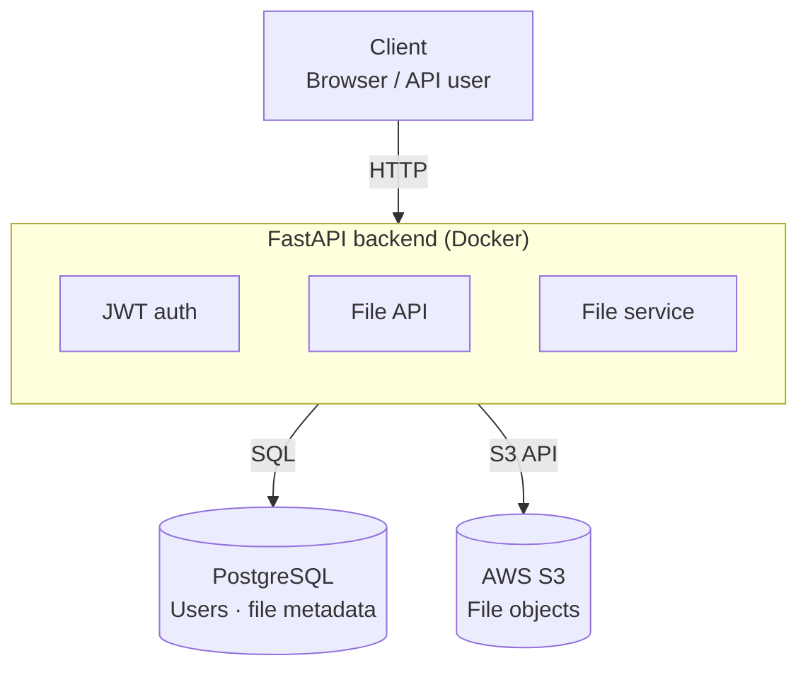

# Cloud File Sharing API

A containerised file-sharing API built with **FastAPI**, **PostgreSQL**, **SQLAlchemy**, **JWT authentication**, and **AWS S3 integration**. Authenticated users can upload, view, update, download, and delete files, and the storage backend can be switched between local disk and S3 without changing any application code.

## Contents

- [Introduction](#introduction)
- [Architecture](#architecture)
- [Tech stack](#tech-stack)
- [Running the project](#running-the-project)
- [API endpoints](#api-endpoints)
- [Docker architecture](#docker-architecture)
- [Limitations](#limitations)
- [Future improvements](#future-improvements)
- [License](#license)

## Introduction

This project is a self-contained backend service for storing and sharing files, similar in spirit to a stripped-down Dropbox or Google Drive API. Users authenticate with a JWT token, then upload files which are tracked in a PostgreSQL database and physically stored either on local disk or in an S3 bucket, depending on configuration.

## Architecture

The project is split into four main packages, plus the FastAPI entrypoint:

```
.
├── authentication/     # JWT auth, password setup/reset, auth schemas
├── database/           # SQLAlchemy models, DB connection, CRUD operations
├── services/           # Business logic connecting routes to storage/DB
├── storage/             # Local filesystem + AWS S3 storage backends
├── main.py             # FastAPI app and route definitions
├── Dockerfile
├── docker-compose.yml
└── requirements.txt
```



**Storage abstraction:** `storage/` exposes a common interface implemented by both a local filesystem backend and an S3 backend. Which one is active is controlled entirely by the `STORAGE_TYPE` environment variable (or the `/storage/{storage_type}` endpoint), so the rest of the app never needs to know which one is in use.

**Auth flow:** Users set a password via `/auth/setup`, log in via `/auth/login` to receive a JWT, and that token is required on the file endpoints. `/auth/reset-password` handles the reset flow.

**Data layer:** File metadata (owner, filename, size, upload date, storage location) is persisted in PostgreSQL via SQLAlchemy models, kept separate from the actual file bytes.

## Tech Stack

- **Backend:** FastAPI
- **Database:** PostgreSQL
- **ORM:** SQLAlchemy
- **Authentication:** JWT
- **Storage:** Local filesystem / AWS S3
- **Containerisation:** Docker + Docker Compose

## Running the Project

### 1. Clone the repository

```bash
git clone https://github.com/T-Coding-Byte/Cloud_File-Sharing_API.git
cd Cloud_File-Sharing_API
```

### 2. Create a `.env` file

Create a `.env` file in the project root:

```env
STORAGE_TYPE=local
PASSWORD_RESET_KEY=your_reset_key
AWS_ACCESS_KEY_ID=your_access_key
AWS_SECRET_ACCESS_KEY=your_secret_key
AWS_REGION=your_region
AWS_BUCKET_NAME=your_bucket_name
```
#####(do not change 'PASSWORD_RESET_KEY=your_reset_key')

To utilise AWS storage, you will need your own AWS account and S3 bucket which will have the neccesary aws keys, region and bucket name. [You can create an S3 bucket here if needed](https://aws.amazon.com/s3), or you can just run the project using local storage.
AWS credentials are only required if using S3 storage (`STORAGE_TYPE=s3`). **Never commit your `.env` file** — keep your AWS credentials and reset key private.

### 3. Start the application

```bash
docker compose up --build
```

The API will be available at `http://localhost:8000`, but it is recommended to use the interactive Swagger docs at `http://localhost:8000/docs`.

To stop the application:

```bash
docker compose down
```

### 4. Initial account setup

Initially, if you have not created an account you will have to do so via the **'| POST | `/auth/setup` | Create user password |'** method to create a password

Upon a successful login, you will receive a JWT token that you should copy, then you should click **"authorise"** on the top right of the swagger docs and paste that token into it to unlock full access to the application

If you need to reset your password, then upon opening the reset password operation, you **must** enter the following secret key as well as choosing a new password:
PASSWORD_RESET_KEY=your_reset_key


## API Endpoints

### Authentication

| Method | Endpoint | Description |
|---|---|---|
| POST | `/auth/setup` | Create user password |
| POST | `/auth/login` | Login and receive JWT token |
| POST | `/auth/reset-password` | Reset password |

### Files

| Method | Endpoint | Description |
|---|---|---|
| POST | `/upload` | Upload a file |
| GET | `/files` | List stored files |
| GET | `/file/{filename}` | Get file metadata |
| GET | `/downloads/{filename}` | Download a file |
| PUT | `/file/{filename}` | Update file metadata |
| DELETE | `/file/{filename}` | Delete a file |

### Storage

| Method | Endpoint | Description |
|---|---|---|
| GET | `/storage/{storage_type}` | Switch active storage backend (`local` or `s3`) |

## Docker Architecture

The application runs as two containers on a shared Docker Compose network:

- **`api`** — the FastAPI application
- **`database`** — PostgreSQL

The API talks to PostgreSQL using the database service name, so no hardcoded IPs or ports are needed between containers.

## Limitations

- No automated test suite yet, so regressions currently rely on manual testing via Swagger UI.
- File size and type validation isn't enforced — uploads are accepted as-is.
- Files aren't yet scoped to the uploading user, so any authenticated user can technically access any file's metadata/download route.

## Future Improvements

- Add automated tests (pytest + FastAPI's TestClient)
- Add file size/type validation
- Add user-specific file ownership and access control
- Deploy using AWS services (ECS/Fargate or EC2 + RDS)
- Add a CI/CD pipeline

## License

This project is licensed under the MIT License — see the [LICENSE](https://github.com/T-Coding-Byte/Cloud_File-Sharing_API/blob/main/LICENSE) file for details.
